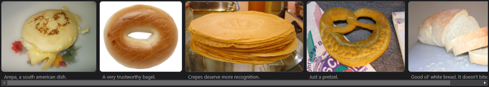
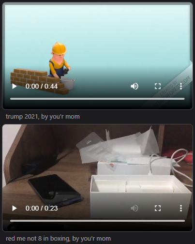
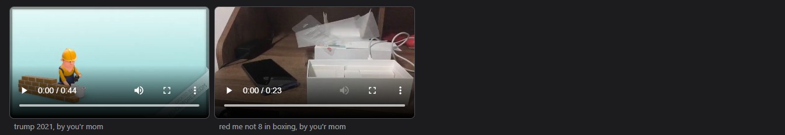
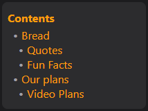
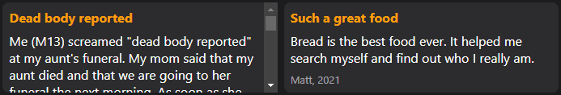

# WARNING: Outdated documentation ahead!
This documentation is severely outdated. Whenever I get time, I'll update it. DO NOT get guidance from this documentation.

# Welcome
Hi GitHub user! This is a test webpage, where I put some stuff I do with HTML/CSS. You'll see updates pretty often while I improve this website.

## Project structure
The project has one main HTML file, with 4 CSS files and an assets folder with different images, videos and other files that may be needed.

### HTML
The HTML is mostly just to show what the CSS can do. No custom styling is there, it just contains the information.

### CSS Files
There are 4 CSS files: `colors`, `general`, `media-queries` and `style`. `colors` contains the colors, including light and dark modes. `general` has styling for HTML elements, mostly applying the colors and changing default padding values. `media-queries` contains different media queries that help make the website more accessible and usable on small screens. Lastly, `style` contains my custom divs that help simplify stuff like stacking items, making elevated sections, you know the deal.

## Custom styling
Here I'll explain what my custom styling is capable of. Everything in this section can be found in the styles.css file.

### hstack-nw
Shorthand for Horizontal Stack - No Wrap. It allows for horizontal item stacking, and it doesn't wrap on any screen size. When overflowed, it allows for scrolling without making the whole page scrollable.

```
<div class="hstack-nw"> /* Container */
  <div> /* Item #1 */
    /* Your stuff */
  </div>

  <div> /* Item #2 */
    /* Your stuff */
  </div>
</div>
```

Here's how it looks:



This stays consistent on small screens, and in case of overflow it becomes scrollable.

### hstack-wrap
Shorthand for Horizontal Stack - Wrap. It allows for horizontal item stacking, and it wraps on phone screens by making every item occupy one column. When overflowed, it allows for scrolling without making the whole page scrollable, and if it's on a phone screen, it makes every item occupy one row.

```
<div class="hstack-wrap"> /* Container */
  <div> /* Item #1 */
    /* Your stuff */
  </div>

  <div> /* Item #2 */
    /* Your stuff */
  </div>
</div>
```

Here's how it looks on a small screen:



And here's how it looks on a big screen:



On small screens (671px width or less), it wraps, and every item uses 100% of the screen width. On big screens (672px width or more), it has the same behaviour that `hstack-nw` does.

### elevated-section
These are elevated sections, using `h4` for the title is recommended. They're like cards.

```
<div class="elevated-section">
  <h4>Heading</h4>
  /* Your stuff */
</div>
```

Here's how it looks:



### elevated-section-fixed
These are elevated sections, with the difference being that it's a fixed size. It reveals its contents on scroll.

```
<div class="elevated-section-fixed">
  <h4>Heading</h4>
  /* Your stuff */
</div>
```

Here's how it looks:



The initial height is 6em.

## Questions that no one asked
### Why are you doing this?
This is mostly just a template with some things I'll need for future projects. You can use it as well, no questions asked. However, it isn't perfect. If you ever find anything you think you can improve, feel free to make a pull request! If I think the change is good, I'll accept it. Remember that anyone can use this, so if you find improvements, they can benefit everyone!

### Can I reach out to you?
Absolutely! Find me on [Telegram](t.me/YourOrdinaryCat) if you need anything.
