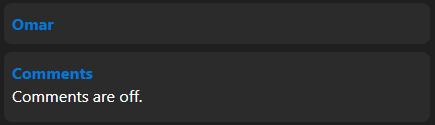

# Welcome
Hi GitHub user! This is a test webpage, where I put some stuff I do with HTML/CSS/PHP/JS. You'll see updates pretty often while I improve this website.

## General details
### CSS
There are 3 main CSS files: `General`, `MediaQueries` and `Style`. `General` has styling for HTML elements, mostly applying colors and changing default values. `MediaQueries` contains different media queries that help make the website more accessible and usable on all screen sizes. Lastly, `Style` contains my custom styling that help simplify stuff like stacking items, making cards, etc.

### HTML
The HTML is generated from PHP files. I use HTML to get GitHub Pages support.

### JavaScript
With JavaScript, I store user settings, store form inputs and some other stuff. It's a fine replacement for some of the stuff I'd have to use PHP for otherwise, but it still doesn't do much.

### PHP
This is the most important part of everything. It outputs the articles (initially PHP files) to HTML, creates landing pages and other important stuff for you.

I decided I wanted to keep everything simple, so there are no databases or anything funny involved. It just works™

## Set everything up
### Stuff you have to do
First off, download a program that allows you to run PHP files. Personally I recommend [XAMPP](https://www.apachefriends.org/index.html) because of how easy to use it is, and I'll assume you use it if you're reading this.

After this, you have to clone the repo and stuff, you're probably already familiar with this. The folder with the repo will have to go under the htdocs folder inside XAMPP's installation folder.

Now that you set everything up, open up the XAMPP Control Panel. Start the Apache module and check that visiting http://localhost/webpage-test/PHP/Generate.php in your browser shows something. If it doesn't, check your folder structure. It should be along the lines of `XAMPP Folder/htdocs/webpage-test/`. Check that the `Generate.php` file exists in the `PHP` folder too. If it still doesn't work then idk I can't see what you're doing wrong it works for me fix it up yourself.

## Writing an article
If the steps above worked, that's great! Now we can get to writing.

### Multiple languages
Add a folder inside `PHP` with the language code you want to add. Copy over the files from another language and check them out. It should be easy to see what needs to get changed.

You need to add an extra entry to one of the `<select>` elements in the Index files with the language code as the value. Don't forget to add the webmanifest and service worker files to the language folder.

You should also add the Index file of your language to the service worker cache in the `SW.js` files.

### Files
First up, the filename. It should have the same name your thumbnail file will get. Thumbnails are stored in the `Assets/Thumbnails` folder and should follow this naming scheme: `Article Filename.png` (and yes, it must be a PNG). If you don't want to use a thumbnail, just don't include one. The default one will be applied. Keep in mind however, if you want to include one, it will be cropped to a 1:1 aspect ratio.

Here's the folder structure of everything in this section:

```
webpage-test
├── Assets
│   └── Thumbnails
│       ├── Default.png
│       └── Article Filename.png
└── PHP
    └── Language code
        └── Articles
            └── Article Filename.php
```

### Getting your article in PHP files
Now you can start actually making articles! Open the PHP file you created in the last section and paste the following inside of it:

```php
<?php
  $title = "Article title";
  $author = "Author";
  $category = "Category";
  $description = "Article description";

  include __DIR__ . "/../Parts/Part1.php";
?>
      <!-- Article contents -->

      <!-- Author card and comments -->
      <?php include __DIR__ . "/../Authors/" . $author . ".html"; ?>
      <?php include __DIR__ . "/../Parts/Comments.html"; ?>

<?php include __DIR__ . "/../Parts/Part2.html"; ?>
      <!-- Outline -->

<?php include __DIR__ . "/../Parts/Part3.html"; ?>
```

The variables at the beginning are used to set the title, author, category and description for the articles. These are used for the homepage and for meta tags.

If you want to remove comments, remove the `<?php include __DIR__ . "/../Parts/Comments.html"; ?>` line. If you don't want an author card, remove the `<?php include __DIR__ . "/../Authors/" . $author . ".html"; ?>` line.

Under `<!-- Article contents -->`... Guess what you have to put. Make sure to give individual IDs to every heading you deem relevant enough.

For the outline, use the following format:

```html
<!-- Headings with subheadings -->
<details>
  <summary>
    <h3><a href="#heading-id">Heading</a></h3>
    <hr class="divider"/>
  </summary>
  <ul>
    <li><a class="nav-link" href="#subheading1-id">Subheading 1</a></li>
    <li><a class="nav-link" href="#subheading2-id">Subheading 2</a></li>
  </ul>
</details>

<!-- Headings without subheadings -->
<ul>
  <li><a class="nav-link" href="#heading-id">Heading</a></li>
</ul>
```

### Author card
In the `PHP/Language code/Authors` folder, add a file called `Author name.html`. Paste the following code into it:

```html
<details class="card">
  <summary>
    <h4>Omar</h4>
  </summary>
  
  <p>Heya! I'm the guy who made this blog! I'm not a developer of anything meaningful, so sit back and watch nothing.</p>
</details>
```

Change the `src` attribute of the image to point to your own image, or remove the whole thing if you don't want one. Replace the contents in `<h4>` with the author name and the ones in `<p>` with a small description.

### Put it all together
Assuming you already fired up XAMPP, visit http://localhost/webpage-test/PHP/Generate.php. Click on the button shown, it will output some files to the `PHP/Output` folder. Copy those files to the project's root folder and check that http://localhost/webpage-test/ shows the blog with your articles. Congratulations! You did it! Wasn't that hard huh? Execution speed is a bit slow (about 0.25s with 2 articles and 2 languages), but it's good enough for me. Of course, there's more improvements to come, specially better documentation.

## Custom styling
Here I'll explain what my custom styling can do. Everything in this section can be found in the `Styles.css` and `General.css` files.

### hstack-nw
Shorthand for Horizontal Stack - No Wrap. It allows for horizontal item stacking, and it doesn't wrap on any screen size. When overflowed, it allows for scrolling without making the whole page scrollable.

```html
<div class="hstack-nw">   /* Container */
  <div>                   /* Item #1 */
    /* Your stuff */
  </div>

  <div>                   /* Item #2 */
    /* Your stuff */
  </div>
</div>
```

Here's how it looks:


This stays consistent on small screens, and in case of overflow it becomes scrollable.

### hstack-wrap
Shorthand for Horizontal Stack - Wrap. It allows for horizontal item stacking, and it wraps on phone screens by making every item occupy one column. When overflowed, it allows for scrolling without making the whole page scrollable, and if it's on a phone screen, it makes every item occupy one row.

```html
<div class="hstack-wrap"> /* Container */
  <div>                   /* Item #1 */
    /* Your stuff */
  </div>

  <div>                   /* Item #2 */
    /* Your stuff */
  </div>
</div>
```

Here's how it looks on a small screen:


And here's how it looks on a big screen:


On small screens (800px width or less), it wraps, and every item uses 100% of the screen width. On big screens (800px width or more), it has the same behaviour that `hstack-nw` does.

### Cards
For cards, I use the `blockquote` and `details` elements. They both can give you different cards depending on your needs.

#### blockquote
These are normal cards, using `h4` for the title is recommended.

```html
<blockquote>
  <h4>Title</h4>
  /* Your stuff */
</blockquote>
```

Here's how it looks:


#### details class="card"
These are like blockquotes, with the difference being that it's a fixed size. It reveals its contents on tap (when opening the `details` element).

```html
<details class="card">
  <summary>
    <h4>Title</h4>
  </summary>
  /* Your stuff */
</details>
```

Here's how it looks:



## Not very frequently asked questions
### Why are you doing this?
This is mostly just a template with some things I (likely won't) need for future projects. You can use it as well, no questions asked. However, it isn't perfect. If you ever find anything you think you can improve, feel free to make a pull request! If I think the change is good, I'll accept it. Remember that anyone can use this, so if you find improvements, they can benefit everyone!

### Can I reach out to you?
Absolutely! Find me on [Telegram](https://t.me/YourOrdinaryCat) if you need anything.
